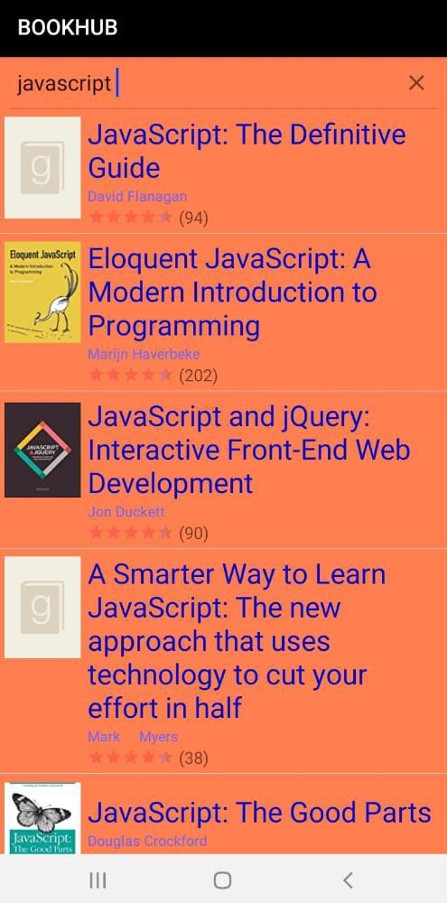
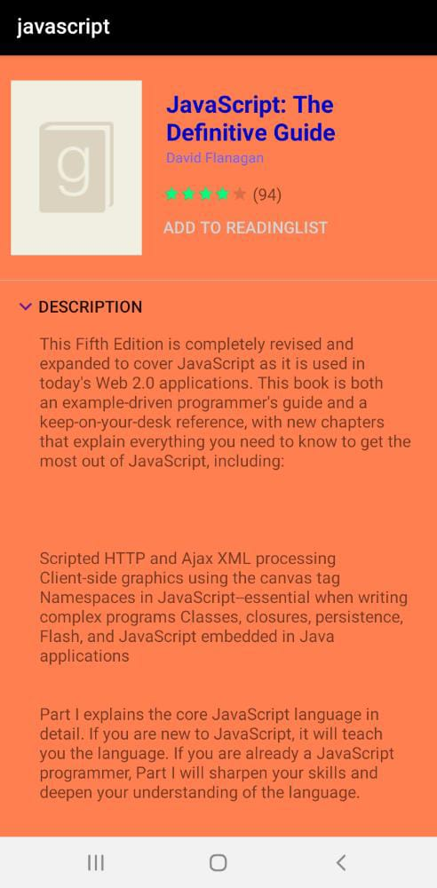
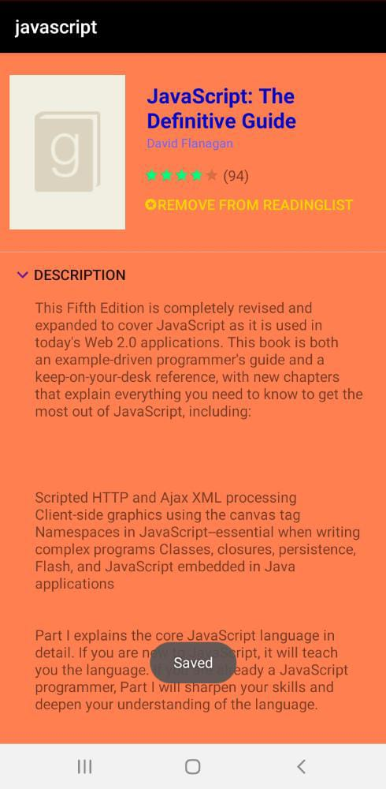
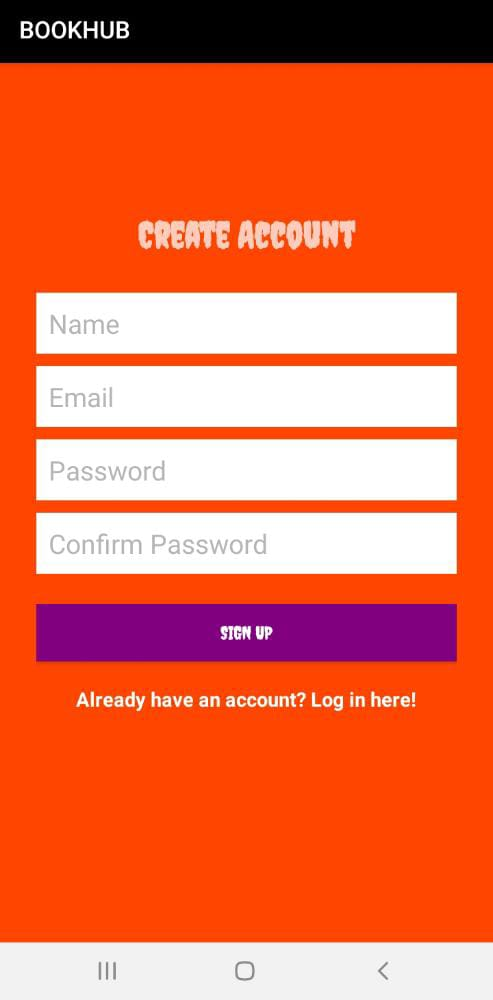
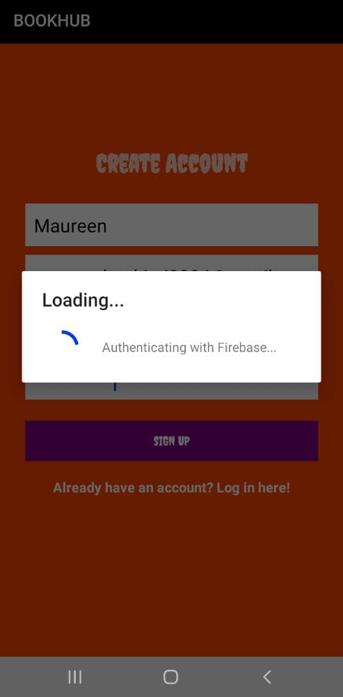
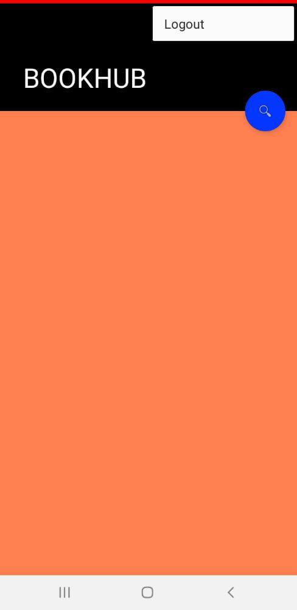

## BOOKHUB
```
An android application that consumes Goodreads API to display books,authors,book ratings and number of pages.Users can also create their reading list,view book description,about author and navigate to Goodreads.
```
## AUTHOR
```
MAUREEN CHEPKIRUI BETT
```
## SCREENSHOTS
      

## FEATURES
```
-Create account
-Login and Logout
-Search for books
-View book description
-View author about and other related books
-View book Reviews
-Create a personal reading-list
-Link to navigate to Goodreads
```


## TECHNOLOGIES
```
Firebase Database

Androidx

Gradle

Java 1.8

Android

Goodreads API
```

## LIBRARIES
```
Picasso - For image loading

XmlPullParser - XML parsing

Volley - Network Library
```

## SETUP
```
Clone repo

Import it to Android Studio

Set up  Emulator or physical device
```

## BUGS
```
Could not implement retrofit so used volley instead
```

## CONTACTS
```
For any clarification contact me on `maureenchepkirui005@gmail.com`
```

## LICENCE
```
MIT Licence copyright Maureen Chepkirui 2020
```


